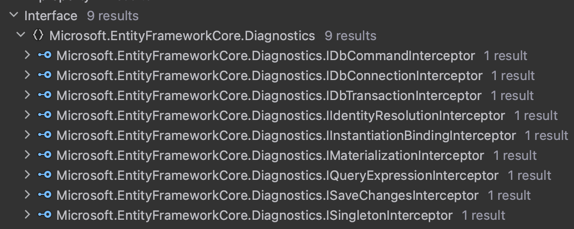

# Entity Framework Core 7 Interceptors

This project shows how to **implement Entity Framework Core 7's interceptors**.

Interceptors allow you to introduce code to other lifecycle events. Here are the known interfaces for lifecycle events.  



- `Microsoft.EntityFrameworkCore.Diagnostics.IDbCommandInterceptor`
- `Microsoft.EntityFrameworkCore.Diagnostics.IDbConnectionInterceptor`
- `Microsoft.EntityFrameworkCore.Diagnostics.IDbTransactionInterceptor`
- `Microsoft.EntityFrameworkCore.Diagnostics.IIdentityResolutionInterceptor`
- `Microsoft.EntityFrameworkCore.Diagnostics.IInstantiationBindingInterceptor`
- `Microsoft.EntityFrameworkCore.Diagnostics.IMaterializationInterceptor`
- `Microsoft.EntityFrameworkCore.Diagnostics.IQueryExpressionInterceptor`
- `Microsoft.EntityFrameworkCore.Diagnostics.ISaveChangesInterceptor`
- `Microsoft.EntityFrameworkCore.Diagnostics.ISingletonInterceptor`

In this example, we are setting the value of a `NotMapped` property to the current time of retrieval using the `IMaterializationInterceptor` interface.

```c#
public class SetRetrievedInterceptor : IMaterializationInterceptor
{
    public object InitializedInstance(MaterializationInterceptionData materializationData, object instance)
    {
        if (instance is IHasRetrieved hasRetrieved)
        {
            hasRetrieved.Retrieved = DateTime.UtcNow;
        }

        return instance;
    }
}
```

Pretty cool.

